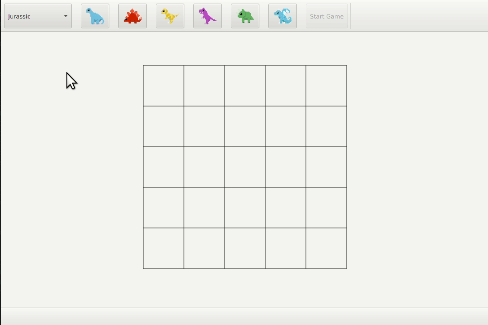

# Disco Zoo Solver
[](https://travis-ci.org/Meebuhs/disco-zoo-solver)

A solver for NimbleBit's mobile game [Disco Zoo](https://en.wikipedia.org/wiki/Disco_Zoo) built to enable an exploration of JavaFX.



The squares most likely to contain an animal are highlighted green and those known to contain one are highlighted yellow.

## Getting Started

### Download

Download the [latest release](https://github.com/Meebuhs/disco-zoo-solver/releases)

### Build 
You can build it yourself using
```
git clone https://github.com/Meebuhs/disco-zoo-solver
cd disco-zoo-solver
./gradlew build 
```

#### Requirements

Requires Java 10 and JavaFX (shipped with OracleJDK but not OpenJDK))

## License

This project is released as open source under the [MIT License](https://opensource.org/licenses/MIT)
